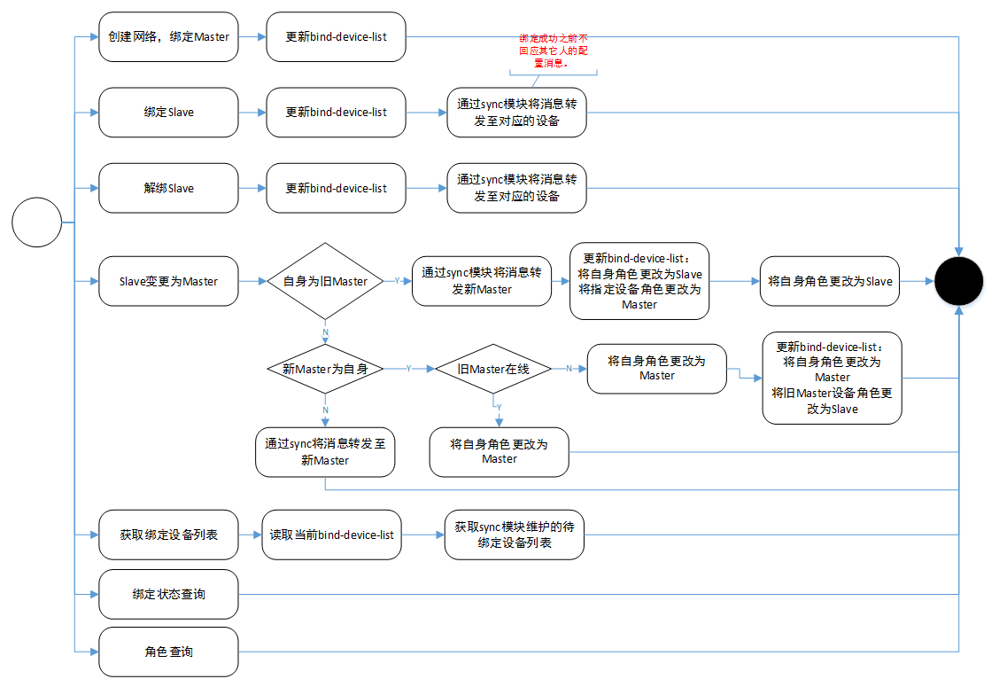

# Sync设计文档
## 概述：
本模块功能是根据用户配置完成Deco 设备的绑定与解绑，负责在每个Deco中维护已绑定的设备列表以及待绑定的设备列表，提供Radar网络的组网信息

## 术语描述：
- Radar网络：各Deco出厂状态下会组成的默认网络，具体描述详见”onboarding接口管理”设计文档
- Radio 网络：各已绑定的Deco之间组成的网络，具体描述详见”onboarding接口管理”设计文档
- Group-info：组网所需要的关键信息
- Dft-group-info：组成Radar网络的组网信息
- Cfg-group-info：组成Radio网络的组网信息
- Role：Deco在网络中所处于的角色，分为Master和Slave，仅在Radio才有此角色划分
- Master：配置为FAP的设备所拥有的角色
- Slave：配置为RE的设备所拥有的角色
- 绑定：将Cfg-group-info信息写入group-info分区
- 变更角色：将Deco从一个Role配置为另一个Role
- 解绑：将group-info分区中的信息擦除并将Deco恢复出厂

## 数据结构与存储：
1. 常用数据结构

```json
Dft-group-info：		
{
"key":"AAAAB3NzaC1yc2EAAAADAQABAAAAQQCYvHoXH2uC3pEjwGquBucDGbfgVYqOPpCk+Mb2WzDRs1l3TqC1ViZwKQplH6+qH6u63msgN/1TYg41iFoBCDB3AAAAQA5KWt1X+2itZ1oM0k5sZz0925uZ6qgAHZYkkAUT0ipZ3vo2L4V24Ld3wgWqbSCtj5F71H3SUFaL6G8ufWHI38kAAAAhAM46HTDl3cD/Zk+6Ja8MmiywCwN0f1zD8qNTRbQb9oNPAAAAIQC9mWWNE9F0NlcplAQ/H6c7vZDg4HAYT2jHuUI6VkhWWQ==",
"gid":"1aa0e1f0-ca78-11e7-a1b9-0c4a09220e01"
}
Cfg-group-info：	
{
"key":"AAAAB3NzaC1yc2EAAAADAQABAAAAQQCYvHoXH2uC3pEjwGquBucDGbfgVYqOPpCk+Mb2WzDRs1l3TqC1ViZwKQplH6+qH6u63msgN/1TYg41iFoBCDB3AAAAQA5KWt1X+2itZ1oM0k5sZz0925uZ6qgAHZYkkAUT0ipZ3vo2L4V24Ld3wgWqbSCtj5F71H3SUFaL6G8ufWHI38kAAAAhAM46HTDl3cD/Zk+6Ja8MmiywCwN0f1zD8qNTRbQb9oNPAAAAIQC9mWWNE9F0NlcplAQ/H6c7vZDg4HAYT2jHuUI6VkhWWQ==",
"gid":"1aa0e1f0-ca78-11e7-a1b9-0c4a09220e01",
"role":"master"
}
Bind-device-list:	
{
"device-id":"00009A6514110513733704CC30D68275197A460D",
"mac":"0C:4A:09:22:0E:00",
"nickname":"living_room",
"role":"master"
}
```

2. 数据存储

a. Dft-group-info 存储:

存放在product-info中,分为key和id两个字段(默认出厂配置且不希望用户更改，在开机加载product-info时，在/tmp 目录下创建dfg-group-info文件，用于其余模块或借口读取配置

b. Cfg-group-info 存储：

继续存放在group-info分区中，开机时将会存放在/tmp/group-info中，并增加新的字段role，此字段将会在绑定与解绑时更随group-info信息一同被修改；

新增字段如何能兼容已发布软件？

c. Bind-device-list:

新增配置项“bind_device_list”，存放在usr config分区中，它将会加入配置同步。

## 主要流程：

绑定首只Deco流程


    
绑定第二只Deco流程图：

  

模块结构图：

  

## Console模块详细设计：
### 模块概述：
Console为对UI接口模块，负责绑定设备，Bind-device-list配置保存，绑定消息的分发，与Sync模块进行交互
### 主要工作：
1.	创建网络：生成Cfg-group-info组网信息
1.	绑定设备：将Cfg-group-info中的组网信息以及角色信息写入group-info分区
1.	Bind-device-list配置保存：仅在FAP中，当绑定新设备时更新Bind-device-list配置并保存
1.	消息分发：当不是绑定自身时，通过sync模块将消息转发给对应的设备
1.	与Sync模块交互：更根据UI需求，获取绑定设备列表
### 运行环境：
Console运行于httpd进程空间，实现在luci层。根据UI请求进行响应。每个响应之间相互独立，可以并行处理。
### 模块流程



### 对外接口：

d)	
```lua
admin.mobile_app.quick_setup
local dispatch_tbl = {      
    newgroup = {
        ["write"] = {cb = creat_m5_group}        
    },
    newdevice = {
        ["write"] = {cb = add_m5_device}        
    }
}
```
- 创建网络，绑定FAP：form=newgroup，operation=write

- 绑定RE：form=newdevice，operation=write

e)	
```lua
admin.mobile_app.device
local dispatch_tbl = {  
    bind_device_list = {
        ["read"] = {cb = get_bind_device_list}       
    },
    rm_bind_device = {
        ["write"] = {cb = rm_bind_device
    },
    change_role = {
        ["write"] = {cb = change_bind_device_role}
    },
```
- 绑定设备列表：form=bind_device_list, operation=read
- 解绑设备：form=rm_bind_device, operation=wrie
- 角色变更：form=change_role, operation=write

f)	model.sync中新增接口：

- get_bind_status()：
    
    判断/tmp/group-info分区信息是否为空，为空则未绑定，反之则绑定成功

- model.sync中修改get_role逻辑：
	
    若已绑定，则从/tmp/group-info中获取role信息；若未绑定则返回error

## Sync模块详细设计：
### 模块概述：
Sync模块负责消息的分发、更新实时的绑定设别列表和待绑定的设备列表、配置同步
### 主要工作：
1.	消息分发：使用已有接口request单播发送tmp请求消息完成。target_type=AP/RE/ALL，新增target_type=UNBIND. ALL包括UNBIND.
1.	更新绑定和带绑定列表：使用probe 接口探测当前网络中的设备，并更新相应列表
1.	配置同步：使用已有接口
### 运行环境：
Sync运行于Sync-Server进程空间，实现对ubus call请求的响应。
### 模块流程：


###	对外接口：
a)	已绑定设备文件：
```json
/tmp/sync-server/mesh_dev_list 
{
"00009A6514110513733704CC30D68275197A460D":
{
"mac":"0C:4A:09:22:0E:00",
"fw_version":"1.1.0 Build 20171109 Rel. 60856",
"ip":"192.168.0.1",
"config_version":"1510800283524",
"role":"master",
"nickname":"living_room",
"inet_status":"online",
"countdown":4,
"channel_5g_2":"0",
"channel_2g":"0"
,"channel_5g":"0",
"emmc_config_version":"0",
"myself":true
}
}
``` 
b)	待绑定设备列表文件
```json
/tmp/sync-server/unbind_dev_list 
{
"00009A6514110513733704CC30D68275197A460D":
{
"mac":"0C:4A:09:22:0E:00",
"fw_version":"1.1.0 Build 20171109 Rel. 60856",
"ip":"192.168.0.1",
"config_version":"1510800283524",
"countdown":4,
"channel_5g_2":"0",
"channel_2g":"0"
,"channel_5g":"0",
"emmc_config_version":"0",
"myself":true
}
}
```
## 附录
[Checklist.md](Checklist.md)

[cmd.md](cmd.md)